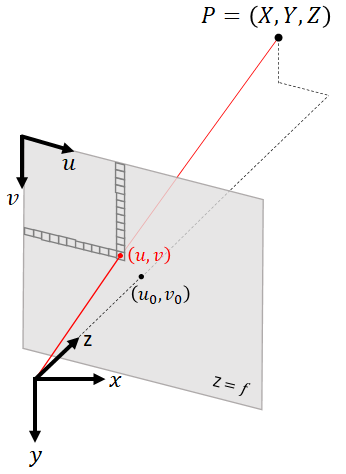
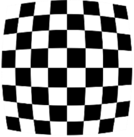
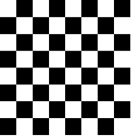
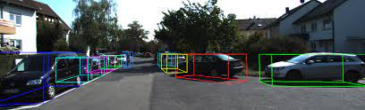

# Tutorial on Computer Vision with Fisheye Cameras
# Introduction
A fisheye camera is a camera whose field of view (FoV) is so large that the image it captures cannot be represented using the perspective projection. Instead of producing rectilinear images, fisheye cameras map straight lines in the 3D world to curved lines in the image according to some known mapping. Fisheye images appear deformed compared to standard perspective images, which we tend to regard as a natural view of the world. Nevertheless, the ability of a single camera to capture a wide FoV makes fisheye cameras extremely valuable in applications such as video surveillance, aerial photography, and autonomous vehicles.

Yet, the computer vision community has neglected to develop a methodical approach to applying the immense progress which has been made since the deep learning revolution to fisheye cameras, leading some authors and practitioners to solutions that are unnecessarily inferior, overcomplicated or outright silly.

This tutorial shows how to handle fisheye cameras much like perspective cameras, making many existing computer vision models that were developed for perspective images applicable to fisheye images directly or with minimal modifications.

We cannot truly understand fisheye cameras without digging into the way computer vision works with perspective images, and the first part of this tutorial will deal only with perspective images. The second part of the tutorial will apply similar principals to fisheye cameras.

We will focus on two computer vision tasks: 2D object detection and monocular 3D object detection (the task of detecting 3D bounding boxes around objects from a single camera, with no additional sensors).

# Perspective images and the pinhole camera model
## The perspective projection
An image is a two-dimensional array of pixels, with size \$H\times\ W\$, where each pixel is a three-dimensional array for a color image. The camera model defines the mapping between a point in 3D space,
\$\$ P=\\left[\\begin{matrix}X\\\\Y\\\\Z\\\\\\end{matrix}\\right],\$\$
and the 2D coordinate of the pixel to which it is mapped,
\$\$p=\\left[\\begin{matrix}u\\\\v\\\\\\end{matrix}\\right].\$\$

In the 3D coordinates we use, the \$x\$ axis is right, the \$y\$ axis is down, the \$z\$ axis is forward (also known as the optical axis), and the origin of axes is the camera’s focal point. In the image coordinates, \$u\$ is right and \$v\$ is down, the pixel indexes can be found by rounding to whole numbers, and the pixel \$\[0, 0\]\$ is the top left corner of the image.
The pinhole camera model is a simple model that is used very often. In this model, the 3D coordinates of a point are related to the homogeneous coordinates of a pixel,
\$\$p^\\prime=\\left[\\begin{matrix}u\\\\v\\\\1\\\\\\end{matrix}\\right],\$\$
by the following transformation:
\$\$p^\\prime Z=KP\$\$
where
\$\$K=\\left[\\begin{matrix}K_{00}&K_{01}&K_{02}\\\\K_{10}&K_{11}&K_{12}\\\\K_{20}&K_{21}&K_{22}\\\\\\end{matrix}\\right]=\\left[\\begin{matrix}f&0&u_0\\\\0&f&v_0\\\\0&0&1\\\\\\end{matrix}\\right].\$\$
is called the intrinsic matrix. The above equation can be written explicitly as
\$\$\\left[\\begin{matrix}u\\\\v\\\\1\\\\\\end{matrix}\\right]Z=\\left[\\begin{matrix}f&0&u_0\\\\0&f&v_0\\\\0&0&1\\\\\\end{matrix}\\right]\\left[\\begin{matrix}X\\\\Y\\\\Z\\\\\\end{matrix}\\right].\$\$

The intrinsic matrix is a special case of a projective transformation (homography) that applies only scaling by the focal length \$f\$ and translation by the principal point \$\\left[u_0, v_0\\right]\$. Some authors allow for different focal lengths along the \$x\$ and \$y\$ axes (i.e., \$K_{00}\neq\ K_{11})\$, but it is always possible to stretch the image to produce an image for which \$K_{00}=K_{11}\$. Some authors allow a nonzero \$K_{01}\$ element, which implies a skew, but it is always possible to de-skew the image to produce an image for which \$K_{01}=0\$. We call the transformation in the equation above the *perspective projection* and images that obey it *perspective images*, also known as *rectilinear images* or *pinhole images*.

The perspective projection is equivalent to finding the intersection of the plane \$Z=1\$ with the ray pointing from the origin of axes towards the point \$P\$, then scaling the intersection point by a factor of \$f\$ horizontally and vertically, and then shifting horizontally by \$u_0\$ and vertically by \$v_0\$.

If we know the coordinates of a 3D point \$\\left[X, Y, Z\\right]\$, or even only a vector pointing in its direction with an arbitrary magnitude, then we can find exactly which pixel that point will appear in using the perspective projection equation.

Similarly, if there is a pixel in the image that is of interest to us, then we can find a 3D vector pointing in its direction by multiplying both sides of the equation by the inverse of the intrinsic matrix:
\$\${\\left[\\begin{matrix}X\\\\Y\\\\Z\\\\\\end{matrix}\\right]=\\left[\\begin{matrix}f&0&u_0\\\\0&f&v_0\\\\0&0&1\\\\\\end{matrix}\\right]}^{-1}\\left[\\begin{matrix}u\\\\v\\\\1\\\\\\end{matrix}\\right]Z.\$\$

Straight horizontal lines in 3D space correspond to straight horizontal lines in the image, and straight vertical lines in 3D space correspond to straight vertical lines in the image. If a pinhole camera takes a picture of a checkerboard pattern perpendicular to the optical axis, it will appear as a perfect checkerboard pattern in the image.

## Pinhole camera distortion
Real cameras do not perfectly obey the pinhole camera model, but we can calibrate their deviation from the pinhole model and then undistort the image to produce an image which does obey the pinhole model. Rather than define the horizontal and vertical shift of each pixel as a lookup table, we often use some parametrized distortion model, typically decomposed into a radial polynomial and a tangential polynomial. See for example the OpenCV documentation [here](https://docs.opencv.org/3.4/dc/dbb/tutorial_py_calibration.html) and [here](https://docs.opencv.org/3.4/d9/d0c/group__calib3d.html).

A checkerboard captured by a real camera might look like this:

After undistorting the image, it will look like this:

The undistorted image obeys the pinhole camera model, i.e., the mapping between 3D points and pixels is determined by the perspective projection.

## 2D Object Detection
In 2D object detection, a neural network receives an image as input, and it outputs 2D bounding boxes, often parametrized as \$\\left(u_{left},v_{top},u_{right},v_{bottom}\\right)\$ and the class (e.g., car, bicycle, pedestrian).

Convolutional neural networks (CNN) have a translation invariance property: if the image size is, say, \$1000\\times1000\$, and the convolution kernel size is \$3\times3\$, and the stride is 1, then the output of the convolution layer is features of the same spatial size \$1000\\times1000\$ where each feature has a receptive field of \$3\times3\$ with respect to the input. Each feature has no access to its spatial coordinate, i.e., it does not “know” where it is in the image. As the network becomes deeper and the feature channels become spatially smaller due to strided convolutions or max-pooling, the receptive field becomes larger, but maintains the translation invariance property. This translation invariance is a prior that provides an inductive bias and plays a significant role in the incredible success of deep learning for computer vision. A car on the left side of the image activates features the same way, using the same network weights, as a car on the right side of the image. The CNN only needs to learn to recognize something that looks like a car, no matter where it is in the image.

The translation-invariance property means that we cannot input an image into a CNN and use network output channels directly as the coordinates of the bounding boxes. Each channel is only a heatmap that activates when it recognizes patterns that look like boundaries of an object, but there is no information about the spatial coordinates in the values of the features themselves. Instead, we must search for a feature whose activation is above a certain threshold, or is a local maximum, and then read its spatial coordinates.

When an image is undistorted and obeys the pinhole camera model, it exhibits a translation invariance which is compatible with the translation invariance of CNNs. If an object facing the camera moves to the left, right, up, or down, it looks the same in an undistorted image, whereas in a distorted image it appears not only shifted but also deformed depending on where it is in the image.

Think of the distorted checkerboard pattern: in order to detect something that in the real world looks like a square, a neural network must learn to recognize many different shapes that deviate from a perfect square. As a more difficult task, a larger network capacity and larger training set are needed to achieve good predictions.

Moreover, if most of the objects in the training set happen to be in the left half of the image and most the objects in the test set happen to be in the right half of the image, we should expect some degradation in distorted images, where the shapes are different, but not in undistorted images, where objects look similar no matter where they are in the image.

For these reasons, it is always a good idea to undistort images before applying computer vision models to them.

## Monocular 3D object detection 
In monocular 3D object detection, we often parametrize the 3D bounding box as:
\$\$u, v, W, H, L, q, Z\$\$
where \$\\left[u, v\\right]\$ are the pixel coordinates of the object’s center in the image, \$\(W, H, L\)\$ are the 3D dimensions of the object, \$q\$ is the [local (allocentric) orientation](https://towardsdatascience.com/orientation-estimation-in-monocular-3d-object-detection-f850ace91411) as a unit quaternion, and \$Z\$ is the depth (the distance along the optical axis). These 10 values, together with the intrinsic camera calibration \$({f,u}_0, v_0)\$, are sufficient to compute the 8 corners of the 3D bounding box.

>Sample from the [KITTI dataset](http://www.cvlibs.net/datasets/kitti/), with 3D bounding box annotations ([CC BY-NC-SA 3.0](https://creativecommons.org/licenses/by-nc-sa/3.0/))

Detecting the 2D location of an object in an image, whether distorted or undistorted, gives us a 3D vector pointing towards the object, but with arbitrary magnitude. To determine the 3D position of the object, we must train the CNN to predict one additional parameter from the image. Why should we predict Z and not the magnitude of the vector, in other words the Euclidean distance to the object?

Now is a good time to pause and remind ourselves of an important fact: neural networks are not magic. All they can do is learn a mapping between images and labels - if the information exists in the image. As machine learning researchers and engineers, we are sometimes so used to supervised learning that we get stuck in a mindset according to which if we have a sufficiently large training set and a sufficiently large neural network, then success is guaranteed.

What if we had a huge dataset of road images like [KITTI](http://www.cvlibs.net/datasets/kitti/), and for every vehicle we also had a ground-truth annotation of what radio station the driver is listening to, or how many cups of coffee he had so far this week? Would we be able to train a neural network to make accurate predictions? Of course not! No matter how large the training set or how large the neural network, that information is not in the images, so the best the network could do is output random predictions with the marginal distribution of the labels over the entire dataset.

Now, why do we expect a neural network to predict the 3D position of objects from an image that is 2D? Where is the 3D information coming from? The answer is that an image from a camera is not just any 2D array of pixels. It is created from a 3D scene using the perspective projection.

One of the properties of the perspective projection is that objects become smaller as they move farther away from the camera and larger as they move closer to the camera. The ratio between the 3D size of the object and its 2D size in the image, known as the magnification, is equal to the focal length divided by the distance along the optical axis \$Z\$, referred to as the depth:
\$\$\\frac{\\Delta u}{\\Delta X}=\\frac{\\Delta v}{\\Delta Y}=\\frac{f}{Z}\$\$
This is easy to derive directly from the projection equation.

Detecting a 2D bounding box around the object is not a difficult task for a CNN, and the focal length is assumed to be known. The unknowns in this equation are the 3D size of the object and its depth. Thus, there is an ambiguity between objects that are small and near the camera and objects that are large and distant from the camera.

If we are trying to detect objects that can come in any size without any correlation between their 3D size and what they look like (e.g., clouds in the sky), it might not be possible to break this ambiguity. But if we are trying to detect objects of categories that have characteristic dimensions, such as cars, then it is possible to train a CNN to predict the 3D size from what the object looks like in the image.

If the CNN can predict the 3D size of an object, we can use the magnification equation to compute \$Z\$, or slightly more sophisticated geometry that considers all 8 corners and a possible yaw (e.g., [Deep3DBox](https://openaccess.thecvf.com/content_cvpr_2017/html/Mousavian_3D_Bounding_Box_CVPR_2017_paper.html)).

Furthermore, if it is possible for a CNN to predict the 3D size and overcome the ambiguity, it should also be possible for a CNN to directly regress \$Z\$ from the image, and many detectors do so (e.g., [CenterNet](https://arxiv.org/abs/1904.07850), [MonoDIS](https://openaccess.thecvf.com/content_ICCV_2019/html/Simonelli_Disentangling_Monocular_3D_Object_Detection_ICCV_2019_paper.html), [FCOS3D](https://openaccess.thecvf.com/content/ICCV2021W/3DODI/html/Wang_FCOS3D_Fully_Convolutional_One-Stage_Monocular_3D_Object_Detection_ICCVW_2021_paper.html)). Once we predict \$Z\$, we normalize the directional vector to \$Z=1\$ and then multiply by the predicted \$Z\$.

The reason we train the CNN to predict \$Z\$ instead of training it to predict the Euclidean distance (and multiplying it by the directional vector normalized to unit \$L_2\$ norm) is that \$Z\$ is the geometrically meaningful measure of distance. Objects become smaller and larger depending on \$Z\$, regardless of horizontal and vertical translation. There is information in the image about \$Z\$, visual cues that a CNN can learn to extract. Here is a picture of seats in a stadium:

Notice how the seats appear smaller in the image as \$Z\$ increases, but seats in the same row, which have equal \$Z\$, all have the same size in the image regardless of their Euclidean distance from the camera.

If we train a CNN to predict the Euclidean distance, we are forcing it to learn, in addition to the cues about \$Z\$, the horizontal and vertical coordinates. This is incompatible with the translation-invariant nature of CNNs.

For a similar reason, we never train a monocular 3D object detector to regress the [global yaw](https://towardsdatascience.com/orientation-estimation-in-monocular-3d-object-detection-f850ace91411) of the object. An object with a fixed yaw changes its appearance in the image as its position changes, so by training a CNN to predict the global yaw directly we would be forcing it to memorize a mapping that is a function of the pixel coordinates. The local yaw, also known as the *allocentric yaw* or *observation angle*, is approximately translation invariant in that an object with a fixed local yaw has a similar appearance in the image regardless of where it is in the image. Practically every published monocular 3D object detector regresses the local yaw.

In the past, it was believed that CNNs are completely translation invariant and that it is impossible for them to regress any spatial information (see [CoordConvs](https://proceedings.neurips.cc/paper/2018/hash/60106888f8977b71e1f15db7bc9a88d1-Abstract.html)), but recent papers have shown this to be false (see [here](http://openaccess.thecvf.com/content_CVPR_2020/html/Kayhan_On_Translation_Invariance_in_CNNs_Convolutional_Layers_Can_Exploit_Absolute_CVPR_2020_paper.html) and [here](https://arxiv.org/abs/2001.08248)): if the network is deep enough, then the zero-padding used in convolution layers breaks the translation invariance and allows networks to learn to output coordinates or coordinate-dependent predictions. Despite this, predicting coordinates will always have some error; therefore, regressing the Euclidean distance will always be less accurate than regressing the depth \$Z\$, and regressing the global yaw will always be less accurate than regressing the local yaw. 

Furthermore, when training a CNN to output coordinate-dependent predictions, it stores the camera calibration (focal length and principal point) somewhere in its weights in an uninterpretable way. As we will see next, this does not allow generalization to new cameras.

## Generalizing to a new camera
In 2D detection, if the images are undistorted, it does not matter too much what the focal length and principal point are, or if they are different during training than during testing, or if the training samples (or test samples) come from multiple cameras with different calibrations.

Monocular 3D object detection is different. Recall, the 3D bounding box parameters which the CNN predicts are
\$\$u, v, W, H, L, q, Z.\$\$
During inference, we use the intrinsic camera calibration to lift these 10 values to the 8 corners of a 3D bounding box.

What happens if during testing we have a new camera with a different calibration? The parameters \$(u, v, W, H, L, q)\$ correspond to visual cues that are not significantly affected by the focal length and principal point, and all we must do is use the new camera calibration when lifting the parameters to a 3D bounding box. Therefore, their prediction can be considered camera agnostic. Yet, the depth \$Z\$ is closely related to the focal length by the magnification equation – it is definitely not camera agnostic.

When we train a CNN to predict \$Z\$, the CNN implicitly learns to compute \$f\\frac{\\Delta X}{\\Delta u}\$ and \$f\\frac{\\Delta Y}{\\Delta v}\$. There are visual cues in the image for \$\\Delta X,\\Delta Y,\\Delta u,\\Delta v\$, but not for \$f\$. The only way a CNN can learn to predict \$Z\$ from examples is to also learn f and to store it somehow in the network weights. Using the camera calibration separately to lift the parameters to a 3D bounding box makes \$(u, v, W, H, L, q)\$ camera agnostic, but \$Z\$ remains camera dependent.

By training the network to predict \$Z/f\$ instead of \$Z\$, the depth prediction becomes camera agnostic. Inverting the magnification equation,
\$\$\\frac{Z}{f}=\\frac{\\Delta X}{\\Delta u}=\\frac{\\Delta Y}{\\Delta v}.\$\$
Therefore, \$Z/f\$ corresponds to visual cues that are camera agnostic. During inference, we multiply the network output by \$f\$ to get \$Z\$.

Now all 3D bounding box parameters are camera agnostic. We can train on one camera, and test on a different camera with a different focal length. We can train on a union of several datasets with different focal lengths, or test on multiple cameras with different focal lengths. The trained CNN is camera agnostic in all its predicted 3D bounding box parameters, and it requires no fine tuning per camera.

All the above is only true if the images are undistorted, the orientation regressed is the allocentric orientation, and the (normalized) depth is along the optical axis. If the images are distorted, or the regressed orientation is the global orientation, or the depth regressed as the Euclidean distance, then the 3D bounding box parameters are no longer camera agnostic. Any difference in camera calibration (focal length, principal point, distortion coefficients) between training and testing will cause a degradation in 3D object detection performance.

[CamConvs](https://openaccess.thecvf.com/content_CVPR_2019/html/Facil_CAM-Convs_Camera-Aware_Multi-Scale_Convolutions_for_Single-View_Depth_CVPR_2019_paper.html) proposed adding coordinate dependent channels to the CNN, but this cannot guarantee that the model becomes camera agnostic. It is better to set up the problem in a way that is translation invariant and ensure it is camera agnostic than to provide the CNN access to spatial coordinates and hope for the best.
