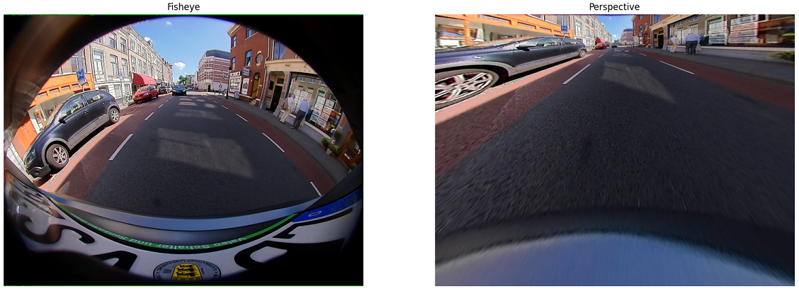

# Tutorial on Computer Vision with Fisheye Cameras
> Author: [Elad Plaut](https://www.linkedin.com/in/elad-plaut)

# Table of Contents
* Table of Content
{:toc}
  
# Introduction
A fisheye camera is a camera whose field of view (FoV) is so large that the image it captures cannot be represented using the perspective projection. Instead of producing rectilinear images, fisheye cameras map straight lines in the 3D world to curved lines in the image according to some known mapping. Fisheye images appear deformed compared to standard perspective images, which we tend to regard as a natural view of the world. Nevertheless, the ability of a single camera to capture a wide FoV makes fisheye cameras extremely valuable in applications such as video surveillance, aerial photography, and autonomous vehicles.

Yet, the computer vision community has neglected to develop a methodical approach to applying the immense progress which has been made since the deep learning revolution to fisheye cameras, leading some authors and practitioners to solutions that are unnecessarily inferior, overcomplicated or outright silly.

This tutorial shows how to handle fisheye cameras much like perspective cameras, making many existing computer vision models that were developed for perspective images applicable to fisheye images directly or with minimal modifications.

We cannot truly understand fisheye cameras without digging into the way computer vision works with perspective images, and the first part of this tutorial will deal only with perspective images. The second part of the tutorial will apply similar principals to fisheye cameras.

We will focus on two computer vision tasks: 2D object detection and monocular 3D object detection (the task of detecting 3D bounding boxes around objects from a single camera, with no additional sensors).

# Perspective images and the pinhole camera model
## The perspective projection
An image is a two-dimensional array of pixels, with size \$H\times\ W\$, where each pixel is a three-dimensional array for a color image. The camera model defines the mapping between a point in 3D space,
\$\$ P=\\left[\\begin{matrix}X\\\\Y\\\\Z\\\\\\end{matrix}\\right],\$\$
and the 2D coordinate of the pixel to which it is mapped,
\$\$p=\\left[\\begin{matrix}u\\\\v\\\\\\end{matrix}\\right].\$\$

In the 3D coordinates we use, the \$x\$ axis is right, the \$y\$ axis is down, the \$z\$ axis is forward (also known as the optical axis), and the origin of axes is the camera’s focal point. In the image coordinates, \$u\$ is right and \$v\$ is down, the pixel indexes can be found by rounding to whole numbers, and the pixel \$\[0, 0\]\$ is the top left corner of the image.
The pinhole camera model is a simple model that is used very often. In this model, the 3D coordinates of a point are related to the homogeneous coordinates of a pixel,
\$\$p^\\prime=\\left[\\begin{matrix}u\\\\v\\\\1\\\\\\end{matrix}\\right],\$\$
by the following transformation:
\$\$p^\\prime Z=KP\$\$
where
\$\$K=\\left[\\begin{matrix}K_{00}&K_{01}&K_{02}\\\\K_{10}&K_{11}&K_{12}\\\\K_{20}&K_{21}&K_{22}\\\\\\end{matrix}\\right]=\\left[\\begin{matrix}f&0&u_0\\\\0&f&v_0\\\\0&0&1\\\\\\end{matrix}\\right].\$\$
is called the intrinsic matrix. The above equation can be written explicitly as
\$\$\\left[\\begin{matrix}u\\\\v\\\\1\\\\\\end{matrix}\\right]Z=\\left[\\begin{matrix}f&0&u_0\\\\0&f&v_0\\\\0&0&1\\\\\\end{matrix}\\right]\\left[\\begin{matrix}X\\\\Y\\\\Z\\\\\\end{matrix}\\right].\$\$

The intrinsic matrix is a special case of a projective transformation (homography) that applies only scaling by the focal length \$f\$ and translation by the principal point \$\\left[u_0, v_0\\right]\$. Some authors allow for different focal lengths along the \$x\$ and \$y\$ axes (i.e., \$K_{00}\neq\ K_{11})\$, but it is always possible to stretch the image to produce an image for which \$K_{00}=K_{11}\$. Some authors allow a nonzero \$K_{01}\$ element, which implies a skew, but it is always possible to de-skew the image to produce an image for which \$K_{01}=0\$. We call the transformation in the equation above the *perspective projection* and images that obey it *perspective images*, also known as *rectilinear images* or *pinhole images*.

The perspective projection is equivalent to finding the intersection of the plane \$Z=1\$ with the ray pointing from the origin of axes towards the point \$P\$, then scaling the intersection point by a factor of \$f\$ horizontally and vertically, and then shifting horizontally by \$u_0\$ and vertically by \$v_0\$.

If we know the coordinates of a 3D point \$\\left[X, Y, Z\\right]\$, or even only a vector pointing in its direction with an arbitrary magnitude, then we can find exactly which pixel that point will appear in using the perspective projection equation.

Similarly, if there is a pixel in the image that is of interest to us, then we can find a 3D vector pointing in its direction by multiplying both sides of the equation by the inverse of the intrinsic matrix:
\$\${\\left[\\begin{matrix}X\\\\Y\\\\Z\\\\\\end{matrix}\\right]=\\left[\\begin{matrix}f&0&u_0\\\\0&f&v_0\\\\0&0&1\\\\\\end{matrix}\\right]}^{-1}\\left[\\begin{matrix}u\\\\v\\\\1\\\\\\end{matrix}\\right]Z.\$\$

Straight horizontal lines in 3D space correspond to straight horizontal lines in the image, and straight vertical lines in 3D space correspond to straight vertical lines in the image. If a pinhole camera takes a picture of a checkerboard pattern perpendicular to the optical axis, it will appear as a perfect checkerboard pattern in the image.

## Pinhole camera distortion
Real cameras do not perfectly obey the pinhole camera model, but we can calibrate their deviation from the pinhole model and then undistort the image to produce an image which does obey the pinhole model. Rather than define the horizontal and vertical shift of each pixel as a lookup table, we often use some parametrized distortion model, typically decomposed into a radial polynomial and a tangential polynomial. See for example the OpenCV documentation [here](https://docs.opencv.org/3.4/dc/dbb/tutorial_py_calibration.html) and [here](https://docs.opencv.org/3.4/d9/d0c/group__calib3d.html).

A checkerboard captured by a real camera might look like this:

After undistorting the image, it will look like this:

The undistorted image obeys the pinhole camera model, i.e., the mapping between 3D points and pixels is determined by the perspective projection.

## 2D Object Detection
In 2D object detection, a neural network receives an image as input, and it outputs 2D bounding boxes, often parametrized as \$\\left(u_{left},v_{top},u_{right},v_{bottom}\\right)\$ and the class (e.g., car, bicycle, pedestrian).

Convolutional neural networks (CNN) have a translation invariance property: if the image size is, say, \$1000\\times1000\$, and the convolution kernel size is \$3\times3\$, and the stride is 1, then the output of the convolution layer is features of the same spatial size \$1000\\times1000\$ where each feature has a receptive field of \$3\times3\$ with respect to the input. Each feature has no access to its spatial coordinate, i.e., it does not “know” where it is in the image. As the network becomes deeper and the feature channels become spatially smaller due to strided convolutions or max-pooling, the receptive field becomes larger, but maintains the translation invariance property. This translation invariance is a prior that provides an inductive bias and plays a significant role in the incredible success of deep learning for computer vision. A car on the left side of the image activates features the same way, using the same network weights, as a car on the right side of the image. The CNN only needs to learn to recognize something that looks like a car, no matter where it is in the image.

The translation-invariance property means that we cannot input an image into a CNN and use network output channels directly as the coordinates of the bounding boxes. Each channel is only a heatmap that activates when it recognizes patterns that look like boundaries of an object, but there is no information about the spatial coordinates in the values of the features themselves. Instead, we must search for a feature whose activation is above a certain threshold, or is a local maximum, and then read its spatial coordinates.

When an image is undistorted and obeys the pinhole camera model, it exhibits a translation invariance which is compatible with the translation invariance of CNNs. If an object facing the camera moves to the left, right, up, or down, it looks the same in an undistorted image, whereas in a distorted image it appears not only shifted but also deformed depending on where it is in the image.

Think of the distorted checkerboard pattern: in order to detect something that in the real world looks like a square, a neural network must learn to recognize many different shapes that deviate from a perfect square. As a more difficult task, a larger network capacity and larger training set are needed to achieve good predictions.

Moreover, if most of the objects in the training set happen to be in the left half of the image and most the objects in the test set happen to be in the right half of the image, we should expect some degradation in distorted images, where the shapes are different, but not in undistorted images, where objects look similar no matter where they are in the image.

For these reasons, it is always a good idea to undistort images before applying computer vision models to them.

## Monocular 3D object detection 
In monocular 3D object detection, we often parametrize the 3D bounding box as:
\$\$u, v, W, H, L, q, Z\$\$
where \$\\left[u, v\\right]\$ are the pixel coordinates of the object’s center in the image, \$\(W, H, L\)\$ are the 3D dimensions of the object, \$q\$ is the [local (allocentric) orientation](https://towardsdatascience.com/orientation-estimation-in-monocular-3d-object-detection-f850ace91411) as a unit quaternion, and \$Z\$ is the depth (the distance along the optical axis). These 10 values, together with the intrinsic camera calibration \$({f,u}_0, v_0)\$, are sufficient to compute the 8 corners of the 3D bounding box.

>Sample from the [KITTI dataset](http://www.cvlibs.net/datasets/kitti/), with 3D bounding box annotations ([CC BY-NC-SA 3.0](https://creativecommons.org/licenses/by-nc-sa/3.0/))

Detecting the 2D location of an object in an image, whether distorted or undistorted, gives us a 3D vector pointing towards the object, but with arbitrary magnitude. To determine the 3D position of the object, we must train the CNN to predict one additional parameter from the image. Why should we predict Z and not the magnitude of the vector, in other words the Euclidean distance to the object?

Now is a good time to pause and remind ourselves of an important fact: neural networks are not magic. All they can do is learn a mapping between images and labels - if the information exists in the image. As machine learning researchers and engineers, we are sometimes so used to supervised learning that we get stuck in a mindset according to which if we have a sufficiently large training set and a sufficiently large neural network, then success is guaranteed.

What if we had a huge dataset of road images like [KITTI](http://www.cvlibs.net/datasets/kitti/), and for every vehicle we also had a ground-truth annotation of what radio station the driver is listening to, or how many cups of coffee he had so far this week? Would we be able to train a neural network to make accurate predictions? Of course not! No matter how large the training set or how large the neural network, that information is not in the images, so the best the network could do is output random predictions with the marginal distribution of the labels over the entire dataset.

Now, why do we expect a neural network to predict the 3D position of objects from an image that is 2D? Where is the 3D information coming from? The answer is that an image from a camera is not just any 2D array of pixels. It is created from a 3D scene using the perspective projection.

One of the properties of the perspective projection is that objects become smaller as they move farther away from the camera and larger as they move closer to the camera. The ratio between the 3D size of the object and its 2D size in the image, known as the magnification, is equal to the focal length divided by the distance along the optical axis \$Z\$, referred to as the depth:
\$\$\\frac{\\Delta u}{\\Delta X}=\\frac{\\Delta v}{\\Delta Y}=\\frac{f}{Z}\$\$
This is easy to derive directly from the projection equation.

Detecting a 2D bounding box around the object is not a difficult task for a CNN, and the focal length is assumed to be known. The unknowns in this equation are the 3D size of the object and its depth. Thus, there is an ambiguity between objects that are small and near the camera and objects that are large and distant from the camera.

If we are trying to detect objects that can come in any size without any correlation between their 3D size and what they look like (e.g., clouds in the sky), it might not be possible to break this ambiguity. But if we are trying to detect objects of categories that have characteristic dimensions, such as cars, then it is possible to train a CNN to predict the 3D size from what the object looks like in the image.

If the CNN can predict the 3D size of an object, we can use the magnification equation to compute \$Z\$, or slightly more sophisticated geometry that considers all 8 corners and a possible yaw (e.g., [Deep3DBox](https://openaccess.thecvf.com/content_cvpr_2017/html/Mousavian_3D_Bounding_Box_CVPR_2017_paper.html)).

Furthermore, if it is possible for a CNN to predict the 3D size and overcome the ambiguity, it should also be possible for a CNN to directly regress \$Z\$ from the image, and many detectors do so (e.g., [CenterNet](https://arxiv.org/abs/1904.07850), [MonoDIS](https://openaccess.thecvf.com/content_ICCV_2019/html/Simonelli_Disentangling_Monocular_3D_Object_Detection_ICCV_2019_paper.html), [FCOS3D](https://openaccess.thecvf.com/content/ICCV2021W/3DODI/html/Wang_FCOS3D_Fully_Convolutional_One-Stage_Monocular_3D_Object_Detection_ICCVW_2021_paper.html)). Once we predict \$Z\$, we normalize the directional vector to \$Z=1\$ and then multiply by the predicted \$Z\$.

The reason we train the CNN to predict \$Z\$ instead of training it to predict the Euclidean distance (and multiplying it by the directional vector normalized to unit \$L_2\$ norm) is that \$Z\$ is the geometrically meaningful measure of distance. Objects become smaller and larger depending on \$Z\$, regardless of horizontal and vertical translation. There is information in the image about \$Z\$, visual cues that a CNN can learn to extract. Here is a picture of seats in a stadium:

Notice how the seats appear smaller in the image as \$Z\$ increases, but seats in the same row, which have equal \$Z\$, all have the same size in the image regardless of their Euclidean distance from the camera.

If we train a CNN to predict the Euclidean distance, we are forcing it to learn, in addition to the cues about \$Z\$, the horizontal and vertical coordinates. This is incompatible with the translation-invariant nature of CNNs.

For a similar reason, we never train a monocular 3D object detector to regress the [global yaw](https://towardsdatascience.com/orientation-estimation-in-monocular-3d-object-detection-f850ace91411) of the object. An object with a fixed yaw changes its appearance in the image as its position changes, so by training a CNN to predict the global yaw directly we would be forcing it to memorize a mapping that is a function of the pixel coordinates. The local yaw, also known as the *allocentric yaw* or *observation angle*, is approximately translation invariant in that an object with a fixed local yaw has a similar appearance in the image regardless of where it is in the image. Practically every published monocular 3D object detector regresses the local yaw.

In the past, it was believed that CNNs are completely translation invariant and that it is impossible for them to regress any spatial information (see [CoordConvs](https://proceedings.neurips.cc/paper/2018/hash/60106888f8977b71e1f15db7bc9a88d1-Abstract.html)), but recent papers have shown this to be false (see [here](http://openaccess.thecvf.com/content_CVPR_2020/html/Kayhan_On_Translation_Invariance_in_CNNs_Convolutional_Layers_Can_Exploit_Absolute_CVPR_2020_paper.html) and [here](https://arxiv.org/abs/2001.08248)): if the network is deep enough, then the zero-padding used in convolution layers breaks the translation invariance and allows networks to learn to output coordinates or coordinate-dependent predictions. Despite this, predicting coordinates will always have some error; therefore, regressing the Euclidean distance will always be less accurate than regressing the depth \$Z\$, and regressing the global yaw will always be less accurate than regressing the local yaw. 

Furthermore, when training a CNN to output coordinate-dependent predictions, it stores the camera calibration (focal length and principal point) somewhere in its weights in an uninterpretable way. As we will see next, this does not allow generalization to new cameras.

## Generalizing to a new camera
In 2D detection, if the images are undistorted, it does not matter too much what the focal length and principal point are, or if they are different during training than during testing, or if the training samples (or test samples) come from multiple cameras with different calibrations.

Monocular 3D object detection is different. Recall, the 3D bounding box parameters which the CNN predicts are
\$\$u, v, W, H, L, q, Z.\$\$
During inference, we use the intrinsic camera calibration to lift these 10 values to the 8 corners of a 3D bounding box.

What happens if during testing we have a new camera with a different calibration? The parameters \$(u, v, W, H, L, q)\$ correspond to visual cues that are not significantly affected by the focal length and principal point, and all we must do is use the new camera calibration when lifting the parameters to a 3D bounding box. Therefore, their prediction can be considered camera agnostic. Yet, the depth \$Z\$ is closely related to the focal length by the magnification equation – it is definitely not camera agnostic.

When we train a CNN to predict \$Z\$, the CNN implicitly learns to compute \$f\\frac{\\Delta X}{\\Delta u}\$ and \$f\\frac{\\Delta Y}{\\Delta v}\$. There are visual cues in the image for \$\\Delta X,\\Delta Y,\\Delta u,\\Delta v\$, but not for \$f\$. The only way a CNN can learn to predict \$Z\$ from examples is to also learn f and to store it somehow in the network weights. Using the camera calibration separately to lift the parameters to a 3D bounding box makes \$(u, v, W, H, L, q)\$ camera agnostic, but \$Z\$ remains camera dependent.

By training the network to predict \$Z/f\$ instead of \$Z\$, the depth prediction becomes camera agnostic. Inverting the magnification equation,
\$\$\\frac{Z}{f}=\\frac{\\Delta X}{\\Delta u}=\\frac{\\Delta Y}{\\Delta v}.\$\$
Therefore, \$Z/f\$ corresponds to visual cues that are camera agnostic. During inference, we multiply the network output by \$f\$ to get \$Z\$.

Now all 3D bounding box parameters are camera agnostic. We can train on one camera, and test on a different camera with a different focal length. We can train on a union of several datasets with different focal lengths, or test on multiple cameras with different focal lengths. The trained CNN is camera agnostic in all its predicted 3D bounding box parameters, and it requires no fine tuning per camera.

All the above is only true if the images are undistorted, the orientation regressed is the allocentric orientation, and the (normalized) depth is along the optical axis. If the images are distorted, or the regressed orientation is the global orientation, or the depth regressed as the Euclidean distance, then the 3D bounding box parameters are no longer camera agnostic. Any difference in camera calibration (focal length, principal point, distortion coefficients) between training and testing will cause a degradation in 3D object detection performance.

[CamConvs](https://openaccess.thecvf.com/content_CVPR_2019/html/Facil_CAM-Convs_Camera-Aware_Multi-Scale_Convolutions_for_Single-View_Depth_CVPR_2019_paper.html) proposed adding coordinate dependent channels to the CNN, but this cannot guarantee that the model becomes camera agnostic. It is better to set up the problem in a way that is translation invariant and ensure it is camera agnostic than to provide the CNN access to spatial coordinates and hope for the best.

## Extrinsic rotation
In autonomous driving, the optical axis of perspective cameras is always parallel to the ground. Even if we believe that the area closer to the ground is more interesting, or that traffic lights and traffic signs which are elevated above the ground are more interesting, we always keep the camera upright and never tilt it upwards or downwards.

One of the advantages in keeping the camera upright is that objects in driving scenes tend to be upright, or parallel to the ground, i.e., they have zero pitch and zero roll. In pinhole cameras, straight horizontal lines in 3D correspond to straight horizontal lines in the image, and straight vertical lines in 3D correspond to straight vertical lines in the image.

If the camera is rotated, many of the interesting objects in the scene, which are aligned to the ground, are no longer parallel to the image plane. See for example this picture taken in New York City:

The optical axis is tilted slightly upwards, and as a result the buildings, which are perpendicular to the ground, appear to tilt towards the right when they are in the left half of the image and towards the left when they are in the right half of the image.

This has several advantages: it does not fit well with the translation invariance property of CNNs, forcing a monocular 3D detector to implicitly learn the pixel coordinates, store the intrinsic calibration and the camera tilt in an uninterpretable way, and consequently does not generalize well to a camera with a different intrinsic calibration or a different tilt. In addition, cubes in 3D do not correspond to 2D rectangles aligned to the pixel grid, so the 2D bounding boxes around objects do not tightly enclose them.

If the camera has a tilt and we cannot physically rotate it to be upright, we can apply a virtual rotation. We use the inverse perspective projection to compute a 3D ray for every pixel, then rotate the ray using the rotation from the tilted camera to an upright coordinate frame parallel to the ground. Then, we use the perspective projection to project the rotated rays to the new image plane. This gives a mapping between the camera pixels and a new image that simulates an upright viewing direction. The pixel mapping is given by
\$\$p^{\\prime\\prime}=sKRK^{-1}p^\\prime,\$\$
where \$p^{\\prime\\prime}\$ denotes the homogeneous pixel coordinates in the warped image simulating an upright view, \$p^\\prime\$ denotes the homogeneous coordinates in the image captured by the tilted camera, \$K\$ is the intrinsic matrix, \$R\$ is the matrix representing the rotation from the tilted camera to the upright coordinate frame parallel to the ground, and s is a scalar value set such that the third element of \$p^{\\prime\\prime}\$ is equal to 1.

In practice, we compute the pixel mapping for the inverse transformation (from target to source), so that every pixel in the target image has some value (in the forward transformation, there is no guarantee that all pixels in the target image are mapped to).

This is the same image from New York City after warping:

In the upright view, objects are aligned to the ground plane and have zero pitch and zero roll, they are translation invariant, the 2D bounding boxes aligned to the pixel grid are tight, and 3D bounding box parameter predictions are independent of intrinsic or extrinsic calibration.

The mapping between a 3D point in (tilted) camera coordinates P and the homogenous pixel coordinates in the warped image \${p^{\\prime\\prime}$ now includes an extrinsic rotation:
\$\$p^{\\prime\\prime} Z=KRP\$\$
where \$R\$ is the rotation matrix from the physical (tilted) camera to the upright coordinate frame parallel to the ground.

# Fisheye cameras
## The Fisheye Projection
Images from fisheye cameras look very different from images captured by perspective cameras. Here is an example of a fisheye image:

>Photo by Josh Berkow and Eric Berkow ([CC BY-SA 3.0](https://creativecommons.org/licenses/by-sa/3.0/deed.en))

At first glance, this might remind us of what a perspective image with radial distortion looks like. Yet, no undistortion can warp this image to an image that obeys the pinhole camera model. In this image, the horizontal field of view is larger than \$180^\\circ\$. It is impossible for a pinhole camera to capture objects that are behind the camera, i.e., at viewing angles larger than \$90^\\circ\$ from the optical axis. The reason straight lines in 3D look curved in this image is because this image was created using an entirely different projection.

There are various projections that are all referred to as *fisheye*, including equidistant, equisolid, stereographic, and orthographic. We shall use the equidistant fisheye camera model.

A 3D point with a viewing angle \$\\theta=\\text{atan2}{\\left(\\sqrt{X^2+Y^2}, Z\\right)}\$, also known the the *angle of incidence*, is projected onto the equidistant fisheye image at a distance from the principal point that is proportional to \$\\theta\$ (if you are not familiar with the *atan2* function, see its definition [here](https://en.wikipedia.org/wiki/Atan2)).

Such images are able to capture objects at viewing angles of \$90^\\circ\$ and beyond, and nothing special happens at \$90^\\circ\$. Many fisheye cameras have a horizontal FoV of around \$190^\\circ\$. The 3D to 2D projection is defined by
\$\$\\left[\\begin{matrix}u\\\\v\\\\1\\\\\\end{matrix}\\right]Z=\\left[\\begin{matrix}f&0&u_0\\\\0&f&v_0\\\\0&0&1\\\\\\end{matrix}\\right]\\left[\\begin{matrix}\\frac{XZ}{\\sqrt{X^2+Y^2}}\\text{atan2}{\\left(\\sqrt{X^2+Y^2},Z\\right)}\\\\\\frac{YZ}{\\sqrt{X^2+Y^2}}\\text{atan2}{\\left(\\sqrt{X^2+Y^2},Z\\right)}\\\\Z\\\\\\end{matrix}\\right].\$\$

## Fisheye cameras and distortion
In the same manner that narrow FoV cameras may deviate from the pinhole camera model and require undistortion in order to obey the perspective projection equation, fisheye cameras may also deviate from the equidistant fisheye model and require undistortion in order to obey the fisheye projection equation. The calibrated distortion parameters associated with a fisheye camera (e.g., radial polynomial coefficients in the [OpenCV model](https://docs.opencv.org/3.4/db/d58/group__calib3d__fisheye.html) or the [WoodScape](https://openaccess.thecvf.com/content_ICCV_2019/papers/Yogamani_WoodScape_A_Multi-Task_Multi-Camera_Fisheye_Dataset_for_Autonomous_Driving_ICCV_2019_paper.pdf) model) define not how to undistort it to an ideal pinhole camera model, but rather how to undistort it to an ideal fisheye camera model.

In the equidistant fisheye model, the distance between a pixel in the image and the principal point, \$r=\\sqrt{\\left(u-u_0\\right)^2+\\left(v-v_0\\right)^2}\$, is directly proportional to the angle between its ray and the optical axis, \$\\theta=\\text{atan2}{\\left(\\sqrt{X^2+Y^2},Z\\right)}\$:
\$\$r=f\\theta.\$\$

In the equisolid fisheye projection \$r=2f\\sin{\\frac{\\theta}{2}}\$, in the stereographic fisheye projection \$r=2f\\tan{\\frac{\\theta}{2}}\$, and in the orthographic fisheye projection \$r=f\\sin{\\theta}\$. In all the examples in this tutorial we will use the equidistant fisheye projection.

In OpenCV, the equidistant fisheye projection is used, and distortion is added by replacing \theta in the projection equation by
\$\$\\theta_d=\\theta+k_1\\theta^3+k_2\\theta^5+k_3\\theta^7+k_4\\theta^9\$\$
where the polynomial coefficients \$k_1, k_2, k_3, k_4\$ determine the radial distortion. With distortion,
\$\$r=f\\theta_d=f\\left(\\theta+k_1\\theta^3+k_2\\theta^5+k_3\\theta^7+k_4\\theta^9\\right).\$\$
In the WoodScape dataset, the equidistant fisheye projection is used again, but distortion is given in terms of \$r\\left(\\theta\\right)\$ such that \$f\$ is hidden inside the distortion coefficients, and the polynomial is of lower order and has both even and odd powers:
\$\$r=a_1\\theta+a_2\\theta^2+a_3\\theta^3+a_4\\theta^4\$\$
Other authors and fisheye camera manufacturers have proposed various other parametrizations, and some define \$r\\left(\\theta\\right)\$ numerically using a lookup table.

It is important to understand the difference between these radial distortion functions and the fisheye projection. The unnatural and deformed appearance of fisheye images are mainly the result of the fisheye projection, not the distortion coefficients. To a human, a fisheye image with zero radial distortion would not look very different from a fisheye image with nonzero distortion – both would look very different from perspective images.

## Using raw fisheye images
Why not just use the fisheye image as-is? We have the images, and we have ground truth 2D or 3D bounding box annotations - why not simply train a neural network?

In fisheye images, when an object moves to the left, right, up or down, it changes its appearance and becomes rotated and deformed. This is unlike perspective images, where objects can move in 3D space, and they will appear shifted in the image but with a similar appearance.

When we train a CNN to predict 2D bounding boxes from fisheye images, it must learn a wide variety of visual appearances of the same object. This is an unnecessarily difficult task. Yet, given a sufficiently large training set and a sufficiently large network, we can do so successfully. Another disadvantage of raw fisheye images is that the 2D bounding boxes aligned to the pixel grid are not tight. This has led [some authors](https://ml4ad.github.io/files/papers2020/FisheyeYOLO: Object Detection on Fisheye Cameras for Autonomous Driving.pdf) to propose representing objects in fisheye images as rotated rectangles, curved boxes, or polygons.

Monocular 3D object detection from raw fisheye images is even more problematic. Let us look again at the fisheye image example:

>Photo by Josh Berkow and Eric Berkow ([CC BY-SA 3.0](https://creativecommons.org/licenses/by-sa/3.0/deed.en))

Notice how all the cars that are parallel parked have the same depth \$Z\$ and the same yaw, yet they look different depending on where they are in the image. There is no translation invariant magnification in fisheye images. When training a CNN to predict 3D bounding box parameters such as orientation and depth, we are forcing it to memorize a mapping which depends on where the object is in the image. No alternative measure of distance or orientation makes the problem translation invariant.

When testing on a new camera, with different focal length, principal point, distortion coefficients and extrinsic rotation, predictions will be worse. [OmniDet](https://arxiv.org/abs/2102.07448) uses a method based on [CamConvs](https://openaccess.thecvf.com/content_CVPR_2019/html/Facil_CAM-Convs_Camera-Aware_Multi-Scale_Convolutions_for_Single-View_Depth_CVPR_2019_paper.html) to provide the CNN access to spatial coordinates, but this does not guarantee that the trained model is camera agnostic.

Some have resorted to avoiding any learning of 3D bounding box parameters. Instead, the CNN only detects a 2D keypoint, such as the point where a wheel of the car touches the ground. Then, the ray corresponding to that point is computed using the fisheye camera model (e.g., by a lookup table). Assuming the ground is flat, the 3D position of the object is estimated as the intersection of this ray with the ground plane. For some use cases, such as detecting adjacent cars when parking, this may work well. Yet, as a more general monocular 3D object detector, this approach is the fisheye equivalent to archaic methods, instead of state-of-the-art monocular 3D object detectors, and it obviously fails at longer distances, when the ground is not flat, and for objects that do not touch the ground.

## Rectification
One of the first instincts many engineers have is to try to rectify the fisheye image, to warp it into a perspective image which obeys the pinhole camera model. As discussed above, pixels in the fisheye image that correspond to viewing angles larger than \$90^\\circ\$ from the camera axis have nowhere to me mapped to in a perspective image. Therefore, it is only possible to create a perspective image with a limited FoV which covers viewing angles smaller than \$90^\\circ\$. Computer vision libraries such as [OpenCV](https://docs.opencv.org/3.4/db/d58/group__calib3d__fisheye.html#ga167df4b00a6fd55287ba829fbf9913b9) offer functions that do so.

To warp a fisheye image to a perspective image, we can compute the inverse pixel mapping ourselves. We multiply the homogeneous coordinates of each pixel in the target perspective image by the inverse intrinsic matrix, which gives us a ray pointing in its direction. Then we project that ray onto the fisheye image using the fisheye camera model.

Here is an example of warping a fisheye image from the [WoodScape dataset](https://openaccess.thecvf.com/content_ICCV_2019/papers/Yogamani_WoodScape_A_Multi-Task_Multi-Camera_Fisheye_Dataset_for_Autonomous_Driving_ICCV_2019_paper.pdf) to a perspective image:

Notice that the perspective image only captures part of the field of view. We created a perspective image with the same image size and intrinsic matrix as the fisheye camera. If we reduce the focal length of the warped image, we can simulate a zoom-out:

The field of view in the warped image is now larger, but still does not capture the full field of view of the fisheye image. No matter how small we make the focal length of the warped image, it will never capture viewing angles larger than \$90^\\circ\$. This begs the question: if we resort to limiting the field of view to one that is suitable for the perspective projection, why did we buy a fisheye camera in the first place? Why not use an actual perspective camera instead?

When the viewing angle is smaller than \$90^\\circ\$ but still large, the warped image suffers from artifacts that become worse farther from the center. These artifacts occur because pixels far from the center have a sparser pixel mapping compared to pixels near the center.

Yet another disadvantage is that objects near the center of the fisheye image become smaller (with information loss) in the warped image and objects at large viewing angles become larger (and blurred) in the warped image, further limiting the performance of computer vision tasks.

## Extrinsic rotation
Fisheye cameras on vehicles are often installed tilted downwards towards the ground, unlike perspective cameras which are always installed upright in vehicles. This may be because in the past, fisheye cameras were used for tasks where the area close to the ground is especially important, such as parking assist systems and rear pedestrian alert systems. Another reason may be that fisheye images look deformed and unnatural whether they are tilted or upright, unlike perspective images who look natural when they are upright but not when they are tilted and more easily convince engineers to install them upright.

The tilt in the WoodScape sample above is evident in the warped image in that straight vertical lines in the 3D world appear to tilt towards the right when they are in the right half of the image and towards the left when they are in the left half of the image.

When warping the fisheye image to a perspective image, we can simulate an upright pinhole camera whose optical axis is parallel to the ground instead of in the same direction as the optical axis of the physical fisheye camera:

Now vertical lines in the 3D world appear as vertical lines in the image, but a large part of the warped image is mapped from outside the field of view of the fisheye image, which is wasteful. We should change the principal point to account for the extrinsic rotation:

Now there are no empty pixels in the warped image, but a large part of the field of view is occupied by the road.

## Multiple rectifications
After concluding that any perspective image is limited to only part of the fisheye camera’s FoV, and we can simulate rotations of the pinhole camera’s optical axis, one might ask: why not create multiple perspective images from a single fisheye camera, each covering a different part of the FoV?
Here is the same WoodScape sample, but instead of an optical axis parallel to the ground and facing forward, we rotate it horizontally \$-45^\\circ\$ in the left image and \$+45^\\circ\$ in the right image:

We could input each perspective image separately into a CNN for processing. However, each perspective image only sees part of the FoV, and objects will often be truncated, i.e., only part of the object is visible, such as the red car in the left edge of the right image above. It is more difficult to detect an object that is only partly visible compared to an object that is fully visible. In monocular 3D detection, this degrades not only the recall but also the 3D bounding box parameter errors (position, orientation, dimensions).

In addition, an object that is visible in two different images is detected twice (once per image), and we must somehow associate the different detections and unify them to a single object prediction. This contradicts the motivation for using wide FoV cameras which could potentially process the entire FoV in a single image.

We could stitch the images together so that they don’t overlap and together create a large image:

The stitched image almost looks natural, but there is a sudden change in the camera model at the invisible border between the two views. We cannot expect a CNN, which is translation invariant, to learn 3D bounding box predictions that depend on whether the object is in the left half of the image, the right half of the image, or on the border between them.

## Cylindrical images to the rescue
### The cylindrical projection
A cylindrical image is the projection of a 3D scene onto the unit cylinder, much like a perspective image is the projection of the 3D scene onto a plane:

In the cylindrical camera model, a 3D point is related to the homogeneous coordinates of the pixel it corresponds to by the following transformation:
\$\$\\left[\\begin{matrix}u\\\\v\\\\1\\\\\\end{matrix}\\right]\\rho=\\left[\\begin{matrix}f_\\varphi&0&u_0\\\\0&f_Y&v_0\\\\0&0&1\\\\\\end{matrix}\\right]\\left[\\begin{matrix}\\rho\\varphi\\\\Y\\\\\\rho\\\\\\end{matrix}\\right],\$\$
where
\$\$\\begin{matrix}\\rho=\\sqrt{X^2+Z^2}\\\\\\varphi=\\text{atan2}{\\left(X, Z\\right)}\\\\\\end{matrix}.\$\$
We refer to \$\\rho\$ as the cylindrical radial distance and to \$\\varphi\$ as the azimuth angle.

Compare the equation above to the perspective projection. Here too there is an intrinsic matrix which applies only scaling and translation. The difference is that here the intrinsic matrix multiplies a 3D point given in cylindrical coordinates rather than Cartesian coordinates.

\$f_\\varphi\$ and \$f_Y\$ are related to the image size and field of view by
\$\$\\begin{matrix}f_\\varphi=\\Phi/W\\\\f_Y=\frac{1}{2}H/\\tan{\\frac{\\Psi}{2}}\\ \\\\\\end{matrix}\$\$
where \$\\Phi\$ is the horizontal field of view and \$\\Psi\$ is the vertical field of view.

### Fisheye to cylindrical warping
Fisheye images can be warped to cylindrical images by computing the inverse pixel mapping. We start from pixel coordinates assumed to have come from the cylindrical image, and multiply the homogeneous coordinates of each pixel by the inverse cylindrical intrinsic matrix. This gives us the cylindrical coordinates of its corresponding ray (normalized to \$\\rho=1\$):
\$\${\\left[\\begin{matrix}\\varphi\\\\Y\\\\1\\\\\\end{matrix}\\right]=\\left[\\begin{matrix}f_\\varphi&0&u_0\\\\0&f_Y&v_0\\\\0&0&1\\\\\\end{matrix}\\right]}^{-1}\\left[\\begin{matrix}u\\\\v\\\\1\\\\\\end{matrix}\\right].\$\$
We convert the cylindrical coordinates to Cartesian coordinates:
\$\$\\left[\\begin{matrix}X\\\\Y\\\\Z\\\\\\end{matrix}\\right]=\\left[\\begin{matrix}\\rho\\sin{\\varphi}\\\\Y\\\\\\rho\\cos{\\varphi}\\\\\\end{matrix}\\right]=\\left[\\begin{matrix}\\sin{\\varphi}\\\\Y\\\\\\cos{\\varphi}\\\\\\end{matrix}\\right].\$\$

Then we project the ray onto the fisheye image using the fisheye projection with the camera’s focal length, principal point, and distortion coefficients. Once the fisheye image is warped to a cylindrical image, it becomes completely independent of the intrinsic parameters of the physical fisheye camera (focal length, principal point, distortion coefficients).

Here is the WoodScape sample, which in a previous section we warped to a perspective image, now warped to a cylindrical image:

### Comparing cylindrical images to perspective images
Warping a fisheye image to a cylindrical image does not cause the problems that arise when trying to warp a fisheye image to a perspective image. A cylindrical image is able to capture a field of view of over \$180^\\circ\$ (nothing special happens at a viewing angle of \$90^\\circ\$), there are no blurs or artifacts, and no drastic changes in the relative area occupied by objects in the image. In many ways, a fisheye image warped to a cylindrical image appears more like a natural perspective image than a fisheye image warped to a perspective image. A cylindrical image could theoretically be created by rotating a pinhole camera and capturing one column of pixels at a time. Straight vertical lines in 3D appear as straight vertical lines in the cylindrical image. The horizon appears as a straight horizontal line, but all horizontal lines other that the horizon behave differently.

Straight horizontal lines in perspective images correspond to curved lines in cylindrical images and straight horizontal lines in cylindrical images correspond to curved lines in cylindrical images.

Here is a perspective image of the Aqueduct of Segovia in Spain:

> Photo by Nicolás Pérez ([CC BY 3.0](https://creativecommons.org/licenses/by/3.0/))

Its straight lines in 3D appear as straight lines in the perspective image. Now, here is a cylindrical image of the same Aqueduct of Segovia:

> Photo by Mario Modesto ([CC BY-SA 3.0](https://creativecommons.org/licenses/by-sa/3.0/deed.en))

To a human used to seeing perspective images, the aqueduct in the cylindrical image looks as if it were round in 3D.

Here is a perspective image of the inside of the Colosseum in Rome:

.jpg)
> Photo by Sebastian Straub ([CC BY 3.0](https://creativecommons.org/licenses/by/3.0/))

The Colosseum is round in 3D, and in the perspective image it indeed looks round.

Here is a cylindrical image of the same Colosseum:

> Photo by Jaakko Luttinen ([CC BY-SA 3.0](https://creativecommons.org/licenses/by-sa/3.0/deed.en))

To a human used to seeing perspective images, in the cylindrical image the Colosseum looks as if it were straight, perhaps similar to the perspective image of the Aqueduct of Segovia.

### A magnification equation for cylindrical images
When looking at the entire FoV, the geometry in cylindrical images appears deformed compared to what we are used to, yet the objects (people, cars, buses) look normal, and we can even imagine how when they are larger they must be closer to the camera and when they are smaller they must be farther away.

In perspective images, there is a translation invariant magnification equal to \$f/Z\$, but this does not apply to cylindrical images.

Is there a translation-invariant magnification in cylindrical images?

If the object is not too large and not too close to the camera, then its width is approximately the length of an arc:
\$\$\\Delta X=\\rho\\sin{\\Delta\\varphi}\\approx\\rho\\Delta\\varphi\$\$
Using this approximation,
\$\$\\Delta u = f_\\varphi \\Delta \\varphi \\approx \\frac{f_\\varphi}{\\rho}\\Delta X\$\$
In the vertical direction we need not use any approximation,
\$\$\\Delta v=\\frac{f_Y}{\\rho}\\Delta Y\$\$
Let us choose \$f_\\varphi=f_Y=f\$ (we are the ones creating the cylindrical image, so we get to choose its intrinsic matrix), and set the size of the cylindrical image size to correspond to the horizontal and vertical FoV:
\$\$\\begin{matrix}W=f\\Phi\\\\H=2f\\tan{\\frac{\\Psi}{2}}\\\\\\end{matrix}\$\$ 
Thus, using the small angle approximation gives us a magnification equation very similar to the magnification equation for pinhole cameras:
\$\$\\frac{\\Delta u}{\\Delta X} = \\frac{\\Delta u}{\\Delta Y} = \\frac{f}{\\rho},\$\$
where instead of the depth \$Z\$ we now have the cylindrical radial distance \$\\rho\$. This means that objects become smaller as they move farther away from the cylinder axis, and larger as they move closer to the cylinder axis. The cylindrical radial distance is the geometrically meaningful measure of distance. An Object can change its \$\varphi\$ and its \$Y\$, and consequently appear shifted in the image, but as long as \$\\rho\$ is preserved it will have a similar appearance and size in the image. There is information in the image about \$\\rho\$, much like there is information about \$Z\$ in a perspective image. Therefore, in cylindrical images it makes sense to regress the \$\\rho\$ of a 3D bounding box center instead of its \$Z\$.

### Training a monocular 3D object detector on cylindrical images
There exist many monocular 3D object detectors which were designed for perspective images (e.g., [CenterNet](https://arxiv.org/abs/1904.07850), [MonoDIS](https://openaccess.thecvf.com/content_ICCV_2019/html/Simonelli_Disentangling_Monocular_3D_Object_Detection_ICCV_2019_paper.html), [FCOS3D](https://openaccess.thecvf.com/content/ICCV2021W/3DODI/html/Wang_FCOS3D_Fully_Convolutional_One-Stage_Monocular_3D_Object_Detection_ICCVW_2021_paper.html)). These detectors regress the following 3D bounding box parameters (or variations of them):
\$\$u, v, W, H, L, q, Z\$\$
During inference, the camera calibration is used (with the perspective projection) to lift the predicted values to a 3D bounding box.

To adapt such a model to cylindrical images, we must make two modifications.

First, when lifting the 3D bounding box from parameters, we must use the cylindrical projection instead of the perspective projection: we compute the ray pointing towards the object by multiplying the homogenous coordinates of a 2D keypoint by the inverse cylindrical intrinsic matrix, remembering that this gives the directional vector in cylindrical coordinates rather than Cartesian coordinates.

Second, during training, we should regress \$\\rho\$ instead of \$Z\$. All other outputs remain unchanged: the 2D keypoint \$\\left[u, v\\right]\$, the 3D dimensions \$(W, H, L)\$ and the local orientation \$q\$ need not be changed. The learned 3D bounding box parameters are thus
\$\$u, v, W, H, L, q, \\rho.\$\$
During inference, we scale the directional vector in cylindrical coordinates such that its cylindrical radial distance is equal to the predicted \$\\rho\$ in order to find the location of the 3D bounding box.

Notice that even though the local orientation is predicted the same way as it was for perspective images, recovering the global orientation from it requires another modification. The global yaw \$\\beta\$ is related to the local yaw \$\\beta_{local}\$ (the angle which the CNN predicts) by
\$\$\\beta=\\beta_{local}+\\varphi\$\$
where \$\\varphi\$ is the azimuth of the ray pointing towards the object. In perspective images,
\$\$\\varphi=\\text{atan}\\left(\\frac{u-u_0}{f}\\right)\$\$
In cylindrical images,
\$\$\\varphi=\\frac{u-u_0}{f}\$\$

### Training on perspective images and testing on cylindrical images
What will happen if we take an existing monocular 3D object detector that was designed for perspective images (e.g., [CenterNet](https://arxiv.org/abs/1904.07850), [MonoDIS](https://openaccess.thecvf.com/content_ICCV_2019/html/Simonelli_Disentangling_Monocular_3D_Object_Detection_ICCV_2019_paper.html), [FCOS3D](https://openaccess.thecvf.com/content/ICCV2021W/3DODI/html/Wang_FCOS3D_Fully_Convolutional_One-Stage_Monocular_3D_Object_Detection_ICCVW_2021_paper.html)), train it only on perspective images, and during inference show it a cylindrical image?

Such a model, to which we have made no adaptations to the cylindrical projection and which has not seen any cylindrical images during training, will process the cylindrical image as if it were a perspective image. It suffers from the same optical illusion we experienced with the cylindrical image of the Colosseum in Rome, as if the walls of the Colosseum had a constant \$Z\$, even though in 3D space they have a constant \$\\rho\$.

The monocular 3D object detector then outputs the 3D bounding boxes which correspond to an imaginary 3D scene which would create the image if it were captured by a pinhole camera.

Using the small angle approximation, we find the transformation from the imaginary 3D bounding box parameters to the parameters of the 3D bounding box around the real object.

The detector predicts a 3D bounding box of an imaginary object at location \$\\left[\\begin{matrix}\\widetilde{X}&\\widetilde{Y}&\\widetilde{Z}\\\\\\end{matrix}\\right]\$, and we know this vector corresponds to cylindrical coordinates of the real object:
\$\$\\left[\\begin{matrix}\\widetilde{X}\\\\\\widetilde{Y}\\\\\\widetilde{Z}\\\\\\end{matrix}\\right]=\\left[\\begin{matrix}\\rho\\varphi\\\\Y\\\\\\rho\\\\\\end{matrix}\\right]=\\left[\\begin{matrix}\\sqrt{X^2+Z^2}\\text{atan2}{\\left(X,Z\\right)}\\\\Y\\\\\\sqrt{X^2+Z^2}\\\\\\end{matrix}\\right]\$\$
The location of the real 3D bounding box in Cartesian coordinates is
\$\$\\left[\\begin{matrix}X\\\\Y\\\\Z\\\\\\end{matrix}\\right]=\\left[\\begin{matrix}\\rho\\sin{\\varphi}\\\\\\widetilde{Y}\\\\\\rho\\cos{\\varphi}\\\\\\end{matrix}\\right]=\\left[\\begin{matrix}\\widetilde{Z}\\sin{\\left(\\widetilde{X}/\\widetilde{Z}\\right)}\\\\\\widetilde{Y}\\\\\\widetilde{Z}\\cos{\\left(\\widetilde{X}/\\widetilde{Z}\\right)}\\\\\\end{matrix}\\right]\$\$
The azimuth and elevation of the ray pointing towards the real object are

\$\$\\left[\\begin{matrix}\\varphi\\\\\\psi\\\\\\end{matrix}\\right]=
\\left[\\begin{matrix}\\text{atan}{\\left(X/Z\\right)}\\\\\\text{atan}{\\left(Y/Z\\right)}\\\\\\end{matrix}\\right]=
\\left[\\begin{matrix}\\text{atan}{\\left(\\tan{\\left(\\widetilde{X}/\\widetilde{Z}\\right)}\\right)}\\\\\\text{atan}{\\left(\\widetilde{Y}/\\left(\\widetilde{Z}\\cos{\\left(\\widetilde{X}/\\widetilde{Z}\\right)}\\right)\\right)}\\\\\\end{matrix}\\right]=
\\left[\\begin{matrix}\\tan{\\widetilde{\\varphi}}\\\\\\text{atan}{\\left(\\tan{\\widetilde{\\psi}}/\\cos{\\left(\\tan{\\widetilde{\\varphi}}\\right)}\\right)}\\\\\\end{matrix}\\right]\$\$

Thus, to recover the 3D bounding box of an object in a cylindrical image using a monocular 3D object detector that was designed for perspective images and trained only on perspective images, all we have to do is apply these transformations to the output as a post-processing step.

The global yaw \$\\beta\$ is related to the local yaw \beta_{local} (the angle which the CNN predicts) by
\$\$\\beta=\\beta_{local}+\\varphi=\\beta_{local}+\\tan{\\widetilde{\\varphi}}\$\$
The following figure illustrates the relationship between the imaginary object and the real object:

The depth \$\widetilde{Z}\$ to the imaginary object is actually the cylindrical radial distance \rho to the real object, and the azimuth of the ray pointing towards the object is changed by applying the tangent function.

When creating the cylindrical image, we choose its size such that its intrinsic matrix is identical to that of the perspective camera used during training. Alternatively, we can normalize the depth regressed from perspective images to \$Z/f\$ during training, and multiply \$\widetilde{Z}\$ by \$f\$ during inference. When using focal length normalization, all 3D bounding box parameters are camera agnostic, and we can test on cylindrical images with an intrinsic matrix different from the intrinsic matrix of the perspective training images, or train (and test) on a union of multiple datasets with different calibrations.

To summarize this method, we take a fisheye image and warp it to a cylindrical image. Then we show it to a standard monocular 3D object detector which was designed for perspective images and was trained only on perspective images (e.g., [CenterNet](https://arxiv.org/abs/1904.07850), [MonoDIS](https://openaccess.thecvf.com/content_ICCV_2019/html/Simonelli_Disentangling_Monocular_3D_Object_Detection_ICCV_2019_paper.html), [FCOS3D](https://openaccess.thecvf.com/content/ICCV2021W/3DODI/html/Wang_FCOS3D_Fully_Convolutional_One-Stage_Monocular_3D_Object_Detection_ICCVW_2021_paper.html), trained on the KITTI dataset). We apply transformations to the outputs as a post processing step, which account for how the predicted \$Z\$ is actually \$\\rho\$ and the ray pointing towards the object is related to the 2D keypoint by the cylindrical projection instead of the perspective projection. The updated azimuth of the ray pointing towards the object is also used to recover the global yaw from the local yaw.

More information about this method can be found in the paper:
***E. Plaut, E. B. Yaacov, B. E. Shlomo, [3D Object Detection from a Single Fisheye Image Without a Single Fisheye Training Image](https://openaccess.thecvf.com/content/CVPR2021W/OmniCV/html/Plaut_3D_Object_Detection_From_a_Single_Fisheye_Image_Without_a_CVPRW_2021_paper.html), Proceedings of the IEEE/CVF Conference on Computer Vision and Pattern Recognition (CVPR), 2021***

#### Failure case and training a model jointly on perspective cameras and fisheye cameras
This method is useful when we want to detect 3D objects from a fisheye camera even though we do not have any training set of fisheye images with 3D bounding box annotations. It works remarkably well as long as the objects are not too large and not too close to the camera.

When an object is large or is close to the camera, the small angle approximation, which leads to the magnification equation equivalent to that of perspective images up to replacement of \$Z\$ by \$\\rho\$, is no longer accurate. Using a standard monocular 3D object detector and interpreting its \$Z\$ output as \$\\rho\$ will be less accurate for such objects.

Wrose yet, such objects look deformed: a cube in 3D appears to have the shape of a banana in the cylindrical image:

This car looks like it is facing towards the right and slightly away from the camera according to the front side of the car, but slightly towards the camera according to the back side of the car. A monocular 3D object detector trained only on perspective images has not seen any car like this and would not be able to predict the orientation of the car. Features that the orientation prediction relies on are out of distribution when activated by such an image, and the orientation prediction might be as good as random.

In order to overcome failure in the yaw prediction of large and near objects, we must obtain a training set of fisheye images and 3D bounding box annotations and train the detector on it.

Perspective images can still be useful for pretraining the model, as we often have a large training set of perspective images and would like to only finetune a model on a small training set of fisheye images.

Another option is to train a joint model on a union of perspective images and fisheye images. During training, when we train on a sample or a batch from a perspective camera, we use the ground truth annotations as usual, and when we train on a sample or a batch from a fisheye camera warped to the cylindrical projection, we use the imaginary object as the ground truth. During inference, when processing an image from a perspective camera we lift the 3D bounding box the usual way, and when processing a cylindrical image from a fisheye camera we lift it using the post-processing transformation from the imaginary object which would create the image if it were a perspective projection to the real object.

### Extrinsic rotation
Earlier, we mentioned that fisheye cameras are often installed tilted slightly downwards towards the ground. If we warp the fisheye image to a cylindrical image with the same optical axis, the warped image will not be practical:

This is because objects tend to be parallel to the ground, and the cylindrical image surface is tilted relative to the ground:

When a cylindrical image is tilted, it does not enjoy the advantages which motivated us to use it in the first place. Hence, we apply a virtual rotation to simulate an upright view, i.e., project the 3D scene onto an upright cylinder even when the physical fisheye camera is tilted.

When warping a fisheye image to a cylindrical image, we compute the inverse pixel mapping. We start from pixel coordinates assumed to have come from the upright cylindrical image, and multiply the homogeneous coordinates of each pixel by the inverse cylindrical intrinsic matrix. This gives us the cylindrical coordinates of its corresponding ray (normalized to \$\\rho=1\$):
\$\${\\left[\\begin{matrix}\\varphi\\\\Y\\\\1\\\\\\end{matrix}\\right]=\\left[\\begin{matrix}f&0&u_0\\\\0&f&v_0\\\\0&0&1\\\\\\end{matrix}\\right]}^{-1}\\left[\\begin{matrix}u\\\\v\\\\1\\\\\\end{matrix}\\right]\$\$
We convert the cylindrical coordinates to Cartesian coordinates:
\$\$\\left[\\begin{matrix}X\\\\Y\\\\Z\\\\\\end{matrix}\\right]=\\left[\\begin{matrix}\\rho\\sin{\\varphi}\\\\Y\\\\\\rho\\cos{\\varphi}\\\\\\end{matrix}\\right]=\\left[\\begin{matrix}\\sin{\\varphi}\\\\Y\\\\\\cos{\\varphi}\\\\\\end{matrix}\\right]\$\$

Before projecting the ray onto the fisheye image using the fisheye camera model, we add an additional step: we rotate the ray by multiplying it with the matrix representing the rotation from the upright view to the tilted camera.

How do we find the extrinsic matrix? Often we have the calibrated transformation between the tilted fisheye camera’s coordinate frame and some upright coordinate frame, such as the vehicle coordinate frame (associated with a localization sensor), or some other sensor such as a Lidar or an upright front-facing perspective camera. We can use this transformation. Beware - such transformations often hide in the rotation matrix a change in the signs of the \$x-y-z\$ axes (e.g., between the right-down-front system we have been using and a front-left-up system), which we must cancel out.

Fisheye cameras are often used for surround view, and a popular choice is to install four cameras facing different directions: front, back, left and right. We would like the optical axis of the cylinder to be parallel to the ground, but in the same viewing direction as the camera. After rotating the cylinder according to the transformation from tilted fisheye camera to upright vehicle, we should rotate it around the new \$y\$ axis (perpendicular to the ground) by some azimuth angle. We will now find that angle.

We write the rotation matrix from the upright coordinate frame to the rotated camera explicitly as
\$\$R=\\left[\\begin{matrix}R_{00}&R_{01}&R_{02}\\\\R_{10}&R_{11}&R_{12}\\\\R_{20}&R_{21}&R_{22}\\\\\\end{matrix}\\right]\$\$
In upright coordinates, the optical axis of the camera is:
\$\$r=\\left[\\begin{matrix}R_{00}&R_{01}&R_{02}\\\\R_{10}&R_{11}&R_{12}\\\\R_{20}&R_{21}&R_{22}\\\\\\end{matrix}\\right]\\left[\\begin{matrix}0\\\\0\\\\1\\\\\\end{matrix}\\right]=\\left[\\begin{matrix}R_{02}\\\\R_{12}\\\\R_{22}\\\\\\end{matrix}\\right]\$\$
By removing the y component, we get a vector pointing in the azimuthal direction of the camera, but parallel to the ground:
\$\$r_\\bot=\\left[\\begin{matrix}R_{02}\\\\0\\\\R_{22}\\\\\\end{matrix}\\right]\$\$

The angle between this vector and the optical axis of the upright cylinder is
\$\$\\phi = \\frac{1}{\\Vert \\begin{matrix} R_{02}&&0&&R_{22} \\end{matrix} \\Vert} \\text{acos} \\left( \\left[\\begin{matrix}0&&0&&1\\end{matrix}\\right] \\left[\\begin{matrix}R_{02}\\\\0\\\\R_{22}\\end{matrix}\\right] \\right) = \\text{acos}\\left(\\frac{R_{22}}{\\sqrt{R_{02}^2+R_{22}^2}}\\right)\$\$

The extrinsic rotation matrix we should use is:
\$\$RR_y\\left(-\\phi\\right)=\\left[\\begin{matrix}R_{00}&R_{01}&R_{02}\\\\R_{10}&R_{11}&R_{12}\\\\R_{20}&R_{21}&R_{22}\\\\\\end{matrix}\\right]\\left[\\begin{matrix}\\cos{\\phi}&0&-\\sin{\\phi}\\\\0&1&0\\\\\\sin{\\phi}&0&\\cos{\\phi}\\\\\\end{matrix}\\right]\$\$

Applying this extrinsic rotation produces the following cylindrical image:

This cylindrical image simulates an upright view, but the top part of it is empty. We should update the principal point to simulate a vertical shift of the image.
How do we find an appropriate principal point? The vertical shift in pixel coordinates is related to the elevation angle of the tilt \$\\tau\$ by

\$\$\\Delta v=-f\\tan{\\left(\\tau\\right)}\$\$

where \$f\$ is the focal length associated with the cylindrical image. The tilt angle \$\\tau\$ is the angle between \$r\$, the optical axis in the upright coordinate frame, and \$r_\\bot\$, the vector parallel to the ground which we computed previously.

\$\$\\phi = \\frac{1}{\\Vert \\begin{matrix} R_{02}&&0&&R_{22} \\end{matrix} \\Vert} \\text{acos} \\left( \\left[\\begin{matrix}R_{02}&&0&&R_{22}\\end{matrix}\\right] \\left[\\begin{matrix}R_{02}\\\\R_{12}\\\\R_{22}\\end{matrix}\\right] \\right) = \\text{acos}\\left(\\sqrt{R_{02}^2+R_{22}^2}\\right)\$\$

Using the trigonometric identity for \$\\tan{\\left(\\text{acos}\\tau\\right)}\$, the vertical shift is

\$\$\\Delta v=-f\\tan{\\left(\\tau\\right)}=-f\\sqrt{\\frac{1}{R_{02}^2+R_{22}^2}-1}\$\$

The new principal point is
\$\$\\left(\\begin{matrix}u_0,&v_0\\\\\\end{matrix}-f\\sqrt{\\frac{1}{R_{02}^2+R_{22}^2}-1}\\right)\$\$

Warping the fisheye image to a cylindrical image with this updated principal point produces the following image:

This is the image we showed earlier when we first introduced the fisheye to cylindrical warping, without mentioning the tilt correction.

In the WoodScale dataset, there are four fisheye cameras, each facing a different direction. The example we have been using is from the rear view. Here are examples from the other three cameras:

Front:

Left:

Right:

There is no reason not to train a single CNN on data from all four cameras jointly.

In order to project a 3D point in fisheye camera coordinates, \$P=\\left[\\begin{matrix}X&&Y&&Z\\end{matrix}\\right],\$ onto the upright cylindrical image, we must use not only the intrinsic matrix but also the extrinsic rotation. Let \$R\$ be the extrinsic matrix, which is the rotation between the fisheye camera’s coordinate frame and the upright coordinate frame (parallel to the ground but in the azimuthal viewing direction of the camera). First, we rotate \$P\$ by \$R\$ by computing \$RP\$. Then we convert the rotated vector to cylindrical coordinates and normalize it to \$\\rho=1\$. Then we multiply the cylindrical coordinates by the cylindrical intrinsic matrix.

When computing the ray associated with a 2D keypoint in the cylindrical image, we multiply the homogeneous coordinates of the keypoint by the inverse intrinsic matrix, then convert from cylindrical coordinates to cartesian coordinates, and then rotate by the inverse extrinsic rotation matrix.

Tilted cameras have one more complication when it comes to monocular 3D object detection. This complication has nothing to do with fisheye cameras or the cylindrical projection, it is merely the result of the tilt itself. When the camera is upright (think of datasets from front facing perspective cameras like KITTI), we often assume that objects have pure yaw rotation with zero pitch and zero roll, where yaw is defined as the rotation around the \$y\$ axis. This is a good approximation, as vehicles are almost always parallel to the ground and the ground is approximately flat. We train detectors to predict only the yaw, and when lifting the 3D bounding box we assume zero pitch and zero roll. However, when the camera is tilted, its \$y\$ axis is no longer perpendicular to the ground, and objects have nonzero roll, pitch and yaw.

The detector sees the cylindrical image, where objects do look parallel to the ground and with pure yaw. Yet, we should not train the detector to predict the yaw of the object annotated in the fisheye camera coordinate frame while ignoring the roll and pitch. Instead, we should compute the orientation of the object in the upright view by accounting for the extrinsic rotation. We do so by simple matrix multiplication or (quaternion multiplication): if \$R\$ is the extrinsic rotation matrix and \$Q\$ is the object orientation matrix in fisheye camera coordinates, then \$RQ\$ is the object orientation associated with the upright cylindrical image. If the object is parallel to the ground, then \$RQ\$ should be a rotation purely around the \$y\$ axis, and the angle of rotation is what we train the monocular 3D object detector to predict.

# Summary
In computer vision, it is important to set up a machine learning model in a way that makes sense geometrically. Neural networks are not magic, and no matter how large the training set is or how large the neural network is, a poorly set up model will never perform as well as a model with a sensible design. When a model is trained with flawed geometry, it may give the appearance of success on a dataset that comes from the same camera and split into training and testing sets. In reality, we are interested in training on samples from multiple cameras, and testing on cameras different from the ones used for data collection, and that is when a proper setup becomes crucial.

There is no translation invariant magnification in raw fisheye images, but under a certain approximation there is a translation invariant magnification in cylindrical images. We should warp fisheye images to upright cylindrical images and train a monocular 3D object detector to regress the cylindrical radial distance to the objects (normalized by the focal length). Then we can train on a union of datasets from fisheye cameras with different calibrations, and test on new cameras with new calibrations. We can also train a monocular 3D object detector on perspective images and test on cylindrical images from fisheye cameras, or train a model jointly on images from perspective cameras and fisheye cameras.
